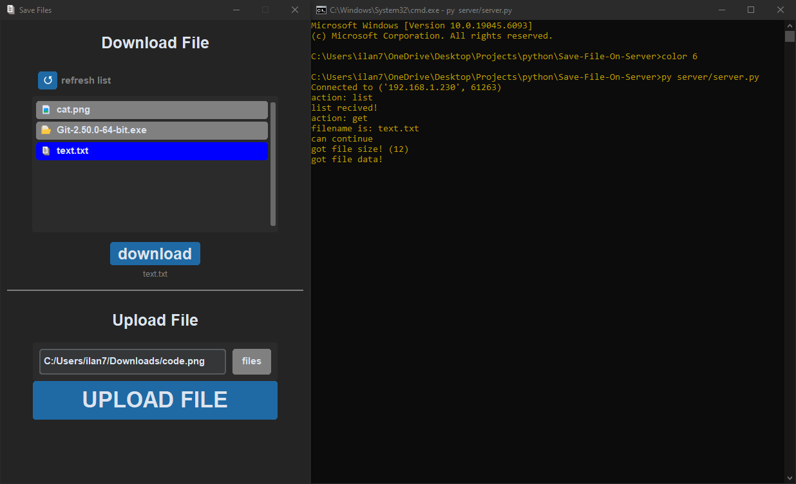

# Save-File-On-Server

a simple server-client file hosting using `Sockets`

## features
### upload files
  - select a file by its path
  - click the `upload file` button

  >you should be able to see your file in the listed storage

### download files
  - select a file from the listed storage by clicking on it
  - click the `download` button
  - select the directory you want to save the file in

  >the file should be saved in the directory you selected

## Running

### server
- `clone` this repo
- cd to the repo's directory in `cmd`
- run: `py server/server.py`

### client
- `clone` this repo
- open the repo's directory in your `ide` or in the `cmd`
- add a file named `server-ip.txt` to the project's directory
- in the file, write the `ip address` of the server's host
- run the `user/main.py` script

